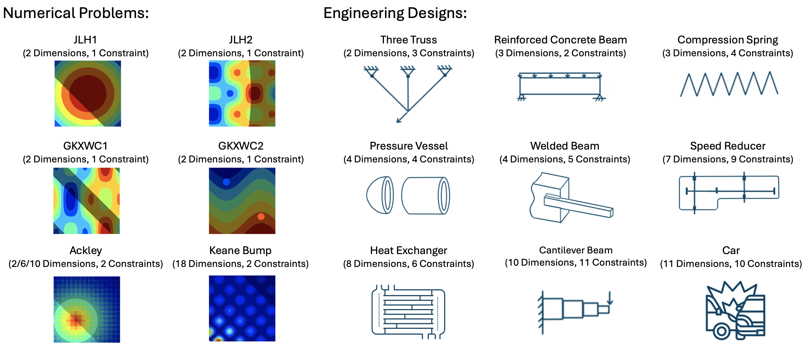

# Benchmarking Engineering Optimization Test Problems with Pre-Trained Transformer-Based Constrained Bayesian Optimization (CBO) Algorithm

## Overview
We introduce fast and accurate CBO algorithms using a prior-data fitted network ([PFN](https://github.com/automl/PFNs4BO), Muller et al. 2023) as a surrogate and compare with the state-of-the-art Bayesian optimization (BO) library [Botorch](https://github.com/pytorch/botorch) using Gaussian Processes (GP). Our PFN-CEI framework exploits the transformer architecture of a PFN for calculating constrained expected improvement as BO's acquisition function, enabling batch processing the calculation of the objective's expected improvement and the probability of feasibility of the constraint in parallel. Tutorials on performing CBO using 3 different constraint-handling techniques and 2 surrogates are included.

To foster collaborative progress, we also put our constrained test problem set and corresponding code in this repo under the "test_functions" folder. 

## Requirements
To run the code, you will need to install:
```
botorch==0.8.4
pytorch-cuda=12.1
```
By git-cloning this repository, you will have the PFN-based CBO code already set up for you with the correct file dependency. With the code released in [PFNs4BO](https://github.com/automl/PFNs4BO), you MUST install the specific Botorch version. We provided an example ```environment.yaml``` file for your reference. 

## Benchmark Test problems
We provided the code of 15 constrained optimization test problems taken from the literature for benchmarking BO methods. 

The way of using it is shown in `Test_function_example.ipynb` and here:
```
import torch
import numpy as np

# Select your test case
from test_functions.Ackley2D import Ackley2D, Ackley2D_Scaling

# Initialized sample in the correct dimension based on the test case
# The test case needs to have X in the range of [0,1] for BO
X = torch.rand(20,2)

# Scale the X in [0,1] to the domain of interest
X_scaled = Ackley2D_Scaling(X)

# The test case output the gx (constaint) and fx (objective)
gx, fx = Ackley2D(X_scaled)
```


## CBO algorithms
The tutorials show you how to use three constraint-handling methods on PFN-based and GP-based CBO in total 6 algorithms we highlighted in our paper. Here is the tutorial on using the six algorithms:

1. `Tutorial_PFN_Pen.ipynb`: PFN-based BO with a penalty function on the objective.
2. `Tutorial_PFN_CEI.ipynb`: PFN-based BO with constrained expected improvement (CEI) as acquisition function.
3. `Tutorial_PFN_CEI_plus.ipynb`: PFN-based BO with thresholded constrained expected improvement (CEI+) as acquisition function.
4. `Tutorial_GP_Pen.ipynb`: GP-based BO with a penalty function on the objective.
5. `Tutorial_GP_CEI.ipynb`: GP-based BO with constrained expected improvement (CEI) as acquisition function.
6. `Tutorial_GP_CEI_plus.ipynb`: GP-based BO with thresholded constrained expected improvement (CEI+) as acquisition function.


## Citation
```
@misc{rosen2024fast,
      title={Fast and Accurate Bayesian Optimization with Pre-trained Transformers for Constrained Engineering Problems}, 
      author={Rosen and Yu and Cyril Picard and Faez Ahmed},
      year={2024},
      eprint={2404.04495},
      archivePrefix={arXiv},
      primaryClass={cs.CE}
}
```
