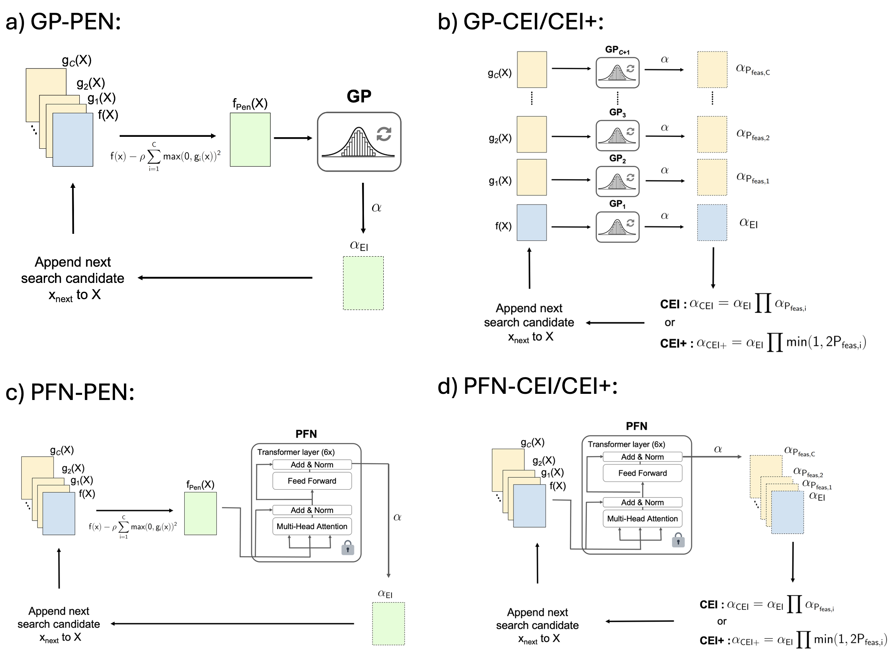

# PFN-CEI: A Pre-Trained Transformer-Based Constrained Bayesian Optimization Algorithm

## Citation


## Introduction
PFN-CEI is constrained Bayesian Optimization (CBO) framework using prior-data fitted network (PFN) that can do faster Bayesian Optimization (BO) than using Gaussian Process (GP). This framework is built upon using [BoTorch](https://github.com/pytorch/botorch) and [PFNs4BO](https://github.com/automl/PFNs4BO). The main contribution is to add the constraint-handling ability to PFNs4BO framework by using the batch processing ability of PFN's transformer structure.  

## CBO algorithms
The tutorials show you how to use three constraint handling methods on PFN-based and GP-based CBO, in total 6 algorithms. Here is the tutorial on using the six algorithms:
1. `Tutorial_GP_Pen.ipynb`: GP-based BO with a penalty function on the objective.
2. `Tutorial_GP_CEI.ipynb`: GP-based BO with constrained expected improvement (CEI) as acquisition function.
3. `Tutorial_GP_CEI_plus.ipynb`: GP-based BO with thresholded constrained expected improvement (CEI+) as acquisition function.
4. `Tutorial_PFN_Pen.ipynb`: PFN-based BO with a penalty function on the objective.
5. `Tutorial_PFN_CEI.ipynb`: PFN-based BO with constrained expected improvement (CEI) as acquisition function.
6. `Tutorial_PFN_CEI_plus.ipynb`: PFN-based BO with thresholded constrained expected improvement (CEI+) as acquisition function.



## Test problems
We provided 15 test optimization problems for benchmarking BO methods. The way of using it is shown in Test_function_example.ipynb and here:
```
import torch
import numpy as np

# Select your test case
from test_functions.Ackley2D import Ackley2D, Ackley2D_Scaling

# Initialized sample in the correct dimension based on the test case
# The test case need to have X in [0,1]
X = torch.rand(20,2)

# Scale the X in [0,1] to the domain of interest
X_scaled = Ackley2D_Scaling(X)

# The test case output the gx (constaint) and fx (objective)
gx, fx = Ackley2D(X_scaled)
```
